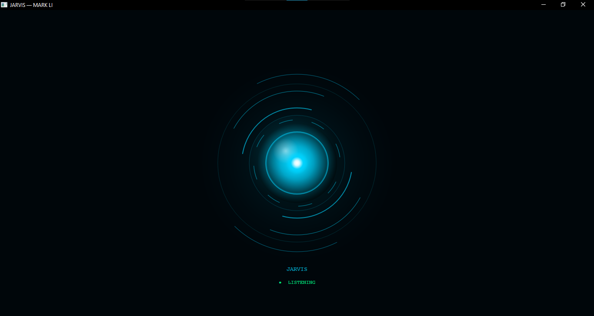
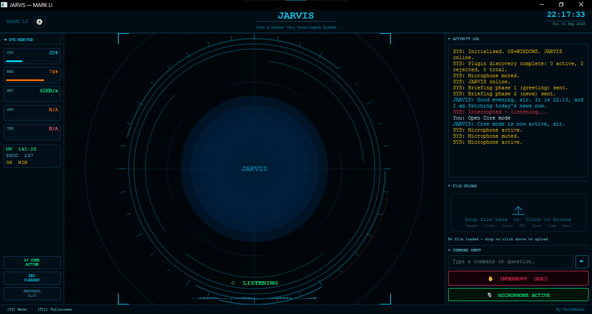

# ⚙️ Mark-LI Advanced

### A maintained derivative of FatihMakes/Mark-LI, focused on extending a local JARVIS-style AI assistant

> **Upstream project:** [FatihMakes/Mark-LI](https://github.com/FatihMakes/Mark-LI)  
> **Derivative maintainer:** [Muhammad Bin Salman](https://github.com/muhammadbinsalman191)  
> **Development branch:** `jarvis-advanced`

Mark-LI Advanced is a public derivative of **MARK LI** by **FatihMakes**. It keeps clear attribution to the upstream project while serving as a separate development branch for my own experiments, interface work, maintenance changes, reliability improvements, and AI-assistant extensions.

This repository does **not** claim authorship of the original MARK LI codebase or upstream features. The purpose of this README is to make the relationship between upstream work and my own maintenance work explicit.

---

## ✨ What Mark-LI Advanced is

The upstream MARK LI project provides the core foundation for a cross-platform personal AI assistant with real-time voice interaction, computer control, plugins, memory, vision, automation, and related capabilities.

**Mark-LI Advanced** builds on that foundation as a maintained derivative. My work in this repository focuses on evolving the experience without hiding where the original project came from.

### Current derivative work

The `jarvis-advanced` branch includes work such as:

- **Core / Command Center mode control** exposed to the assistant through a `set_ui_mode` tool in `main.py`
- AI-controlled switching requests for entering or leaving the Command Center
- **Core protocol and prompt refinements**
- **Runtime-memory protection work**, including keeping personal runtime memory out of normal source-control history
- Ongoing interface, integration, debugging, and maintainability work
- A separate development branch so custom work can evolve without pretending to replace upstream

> I only list derivative changes here when they are actually present in this repository. Upstream MARK LI capabilities remain credited to FatihMakes.

---

## 🧭 Upstream vs. derivative ownership

| Area | Attribution |
|---|---|
| Original MARK LI project and core architecture | **FatihMakes / upstream contributors** |
| Original MARK LI feature set | **FatihMakes / upstream contributors** |
| `Mark-LI-Advanced` repository maintenance | **Muhammad Bin Salman** |
| `jarvis-advanced` branch changes | **Muhammad Bin Salman**, except where code is inherited from upstream |
| Future community contributions to this repo | Their respective contributors |

The upstream project can be found here:

**https://github.com/FatihMakes/Mark-LI**

---

## 🚀 Quick start

Clone this repository and switch to the maintained development branch:

```bash
git clone https://github.com/muhammadbinsalman191/Mark-LI-Advanced.git
cd Mark-LI-Advanced
git checkout jarvis-advanced
pip install -r requirements.txt
python main.py
```

> **Note:** Some dependencies are operating-system specific. If a required module is missing, follow the dependency/setup guidance in the repository before opening an issue.

---

## 📋 Requirements

| Requirement | Details |
|---|---|
| OS | Windows 10/11, macOS, or Linux |
| Python | Follow the version supported by the current branch |
| Microphone | Required for voice interaction |
| API key | Gemini API key used by the current assistant runtime |
| Git | Recommended for updates and contribution workflow |

---

## 🧩 Architecture overview

The inherited MARK LI architecture is organized around a live AI session, a desktop UI, action modules, plugins, local configuration, and memory.

```text
Mark-LI-Advanced/
├── main.py
├── ui.py
├── setup.py
├── requirements.txt
├── actions/
├── core/
├── config/
├── memory/
├── plugins/
├── dashboard/
└── ...
```

### Important areas

- `main.py` — live assistant session, tool declarations and dispatch
- `ui.py` — desktop interface
- `actions/` — computer, browser, file, search, media and system actions
- `core/` — prompt / assistant infrastructure and plugin-related components
- `memory/` — local memory infrastructure
- `plugins/` — extendable assistant skills

---

## 🖥️ Screenshots

Real screenshots should be taken from the current `jarvis-advanced` build so the README shows what the repository actually contains.

Recommended files:

```text
docs/screenshots/core-mode.png
docs/screenshots/command-center.png
docs/screenshots/tool-in-action.png
```

After adding the real images, enable this section:

<!--
### Core Mode



### Command Center



### Assistant action / tool execution


-->

---

## 🛠️ Maintenance goals

This derivative is maintained with a focus on:

- making custom changes easy to identify
- keeping upstream attribution clear
- reducing regressions during UI and tool changes
- keeping local/private runtime data out of Git
- improving documentation for contributors
- tracking bugs and feature requests through GitHub Issues
- creating clearer release notes and milestones as the project matures

See [ROADMAP.md](ROADMAP.md) for planned work.

---

## 🤝 Contributing

Contributions are welcome when they improve reliability, documentation, usability, accessibility, cross-platform behavior, testing, or clearly scoped assistant capabilities.

Please read [CONTRIBUTING.md](CONTRIBUTING.md) before opening a pull request.

For bugs or feature requests, use the GitHub Issue templates included in this repository.

---

## 🔐 Security and privacy

Do **not** commit:

- API keys
- authentication tokens
- private certificates
- personal memory files
- local configuration containing secrets
- screenshots containing private information

If you discover a security issue, please follow [SECURITY.md](SECURITY.md).

---

## ⚠️ Licensing and upstream terms

This repository is derived from **FatihMakes/Mark-LI**. The upstream repository states that its project is for personal/non-commercial use under **CC BY-NC 4.0**.

This repository does not attempt to override or relicense inherited upstream code. Users and contributors are responsible for complying with the upstream project's applicable terms and attribution requirements.

Because licensing terms can affect whether software is considered "open source" under different definitions, this repository should be described accurately as a **public derivative / source-available project** unless and until the applicable licensing position is clarified.

---

## 🙏 Credits

### Original project

**FatihMakes** — creator and upstream maintainer of MARK LI  
https://github.com/FatihMakes/Mark-LI

### Derivative maintainer

**Muhammad Bin Salman**  
GitHub: https://github.com/muhammadbinsalman191

Mark-LI Advanced exists because of the work of the original MARK LI project and its contributors. Upstream credit should remain visible in derivative documentation and source distributions.
